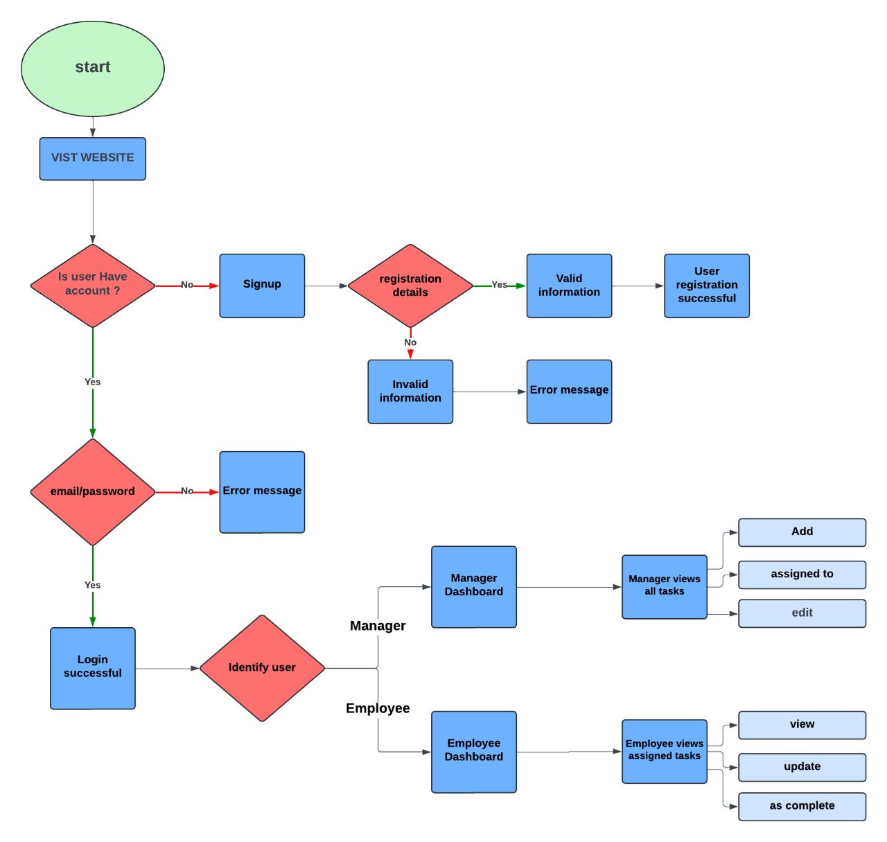
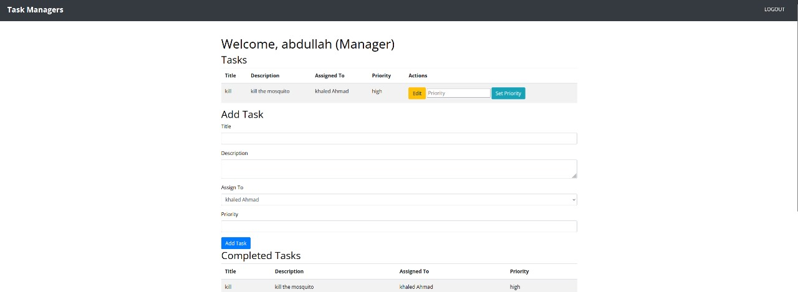
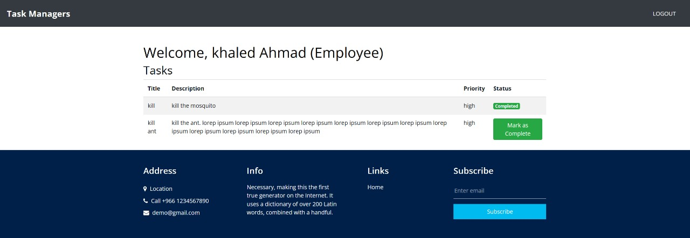

  # Task Manager
  

---

  ## Team Members
  | Student Name  | Student ID |
  | ------------- | ------------- |
  | Faisal Abdulaziz Almasri | 442015855  |
  | Faisal Waleed Al-Kindy  | 441014251  |
  | Morad Ibrahim Al-aziq  | 441017699  |
  

---

## Project overview

### Website Purpose
The website is designed to facilitate task management within an organization, 
catering to both managers and employees. The primary functions include task assignment, status tracking, and priority management.
The platform provides different dashboards for managers and employees, ensuring each user role has access to the tools and information they need.

---

### Flow Chart

---

### Setup
#### Prerequisites
- Node.js and npm installed.
- MongoDB instance (local or cloud-based).
- Environment variables configured in .env file.

#### Steps
1. Clone The Repositry.
2. Install dependecies.
3. Set up environmental variables.
4. Start the server.

---

### Technologies Used
- Node.js: JavaScript runtime for building the server-side application.
- Express: Web framework for Node.js to manage routing and middleware.
- MongoDB: NoSQL database for storing user and task data.
- Mongoose: ODM library for MongoDB to model data.
- EJS: Template engine for rendering dynamic HTML pages.
- Bootstrap: CSS framework for responsive design.

---

### Goals
- User-Friendly Interface: Create an intuitive interface for both managers and employees.
- Task Management: Allow managers to assign, edit, and track tasks efficiently.
- Progress Tracking: Enable employees to update their task status and provide feedback.
- Secure Authentication: Ensure secure login and user management through JWT.
- Scalability: Design the system to handle growing data and user base.

---

### Screen shots
1. Login Page:

2. Manager Page:

3. Employee Page:

---

### Future work
- Enhanced Reporting: Implement detailed reports and analytics for task progress.
- Notifications: Add email and in-app notifications for task updates and reminders.
- Mobile App: Develop a mobile application for on-the-go task management.
- Role-based Access Control: Improve security by adding more granular access controls based on user roles.
- Integration with Calendar Apps: Sync tasks with popular calendar applications for better schedule management.

---

### Resources
- Node.js Documentation: [Node.js](https://nodejs.org/)
- Express Documentation: [Express](https://expressjs.com/)
- MongoDB Documentation: [MongoDB](https://docs.mongodb.com/)
- Mongoose Documentation: [Mongoose](https://mongoosejs.com/docs/)
- Bootstrap Documentation: [Bootstrap](https://getbootstrap.com/docs/)

